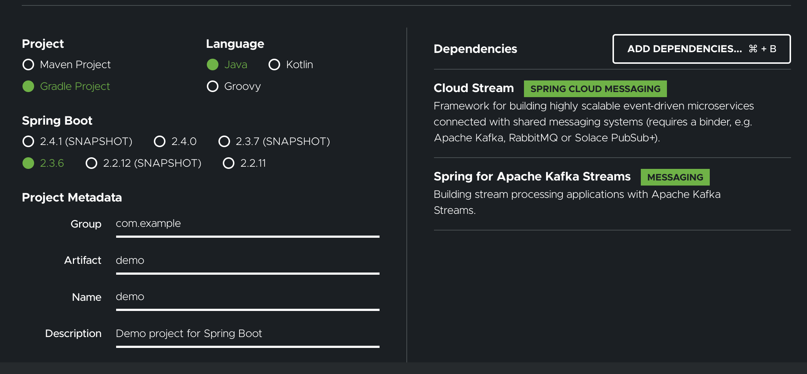

Cloud-stream-gradle
===============
The goal of this repository is to show a problem that I am facing 
using [start.spring.io](https://start.spring.io/), when I try to create a project
with Spring Cloud Stream and Gradle.

## Project
This project is exactly the same as the generated by [Spring Initializr](https://start.spring.io/)
with the following options:


## Problem
The project doesn't build, throwing the following error when downloading the dependencies:

```
Execution failed for task ':compileTestJava'.
> Could not resolve all files for configuration ':testCompileClasspath'.
   > Could not find org.springframework.cloud:spring-cloud-stream:test-binder.
     Required by:
         project :
   > Could not find org.springframework.cloud:spring-cloud-stream:test-binder.
     Required by:
         project :
   > Could not find org.springframework.cloud:spring-cloud-stream:test-binder.
     Required by:
         project : > org.springframework.cloud:spring-cloud-stream-binder-kafka-streams:3.0.9.RELEASE > org.springframework.cloud:spring-cloud-stream-binder-kafka-core:3.0.9.RELEASE
```

This [GitHub Actions execution](https://github.com/henriquels25/cloud-stream-gradle/runs/1506915780) shows the error.

The problem is caused by the following dependency:

`testImplementation 'org.springframework.cloud:spring-cloud-stream:test-binder@test-jar'`

When it is removed, the project builds normally, as it can be observed in the branch `remove_test_dependency`
and in [this](https://github.com/henriquels25/cloud-stream-gradle/actions/runs/404228729) pipeline execution.

The solution is changing the test dependency to the following:
```
testImplementation("org.springframework.cloud:spring-cloud-stream") {
    artifact {
        name = "spring-cloud-stream"
        extension = "jar"
        type = "test-jar"
        classifier = "test-binder"
    }
} 
```

With this, the project builds, as it can be observed in [this](https://github.com/henriquels25/cloud-stream-gradle/runs/1507742542) 
CI execution.